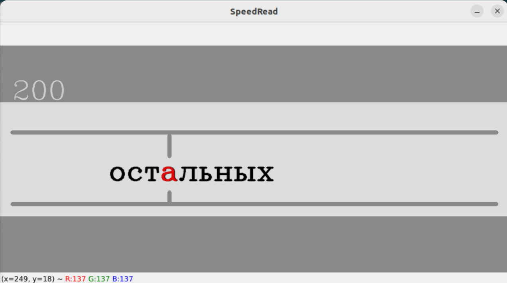

# speed_reader
Press <SPACE> to pause, <ESC> or <q> to exit. To control the speed, use the "up" or "down" arrows. Go back eight words - the arrow "left", jump six words forward - the arrow "right". Have fun reading!
```
python main.py path/to/file.txt
```

